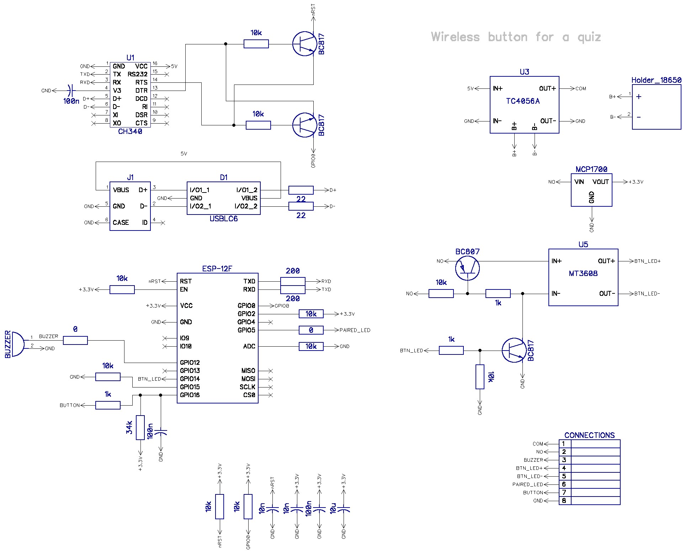

# Wireless Quiz buttons

More information (in Russian) - https://ra0sms.com/wifi-quiz-buttons

Two buttons connect through wi-fi (espnow protocol). When one button is pressed other button can't be activated.

Two buttons in enclosures

### Schematic:

Video - https://youtu.be/kfT6WGKPQZE

